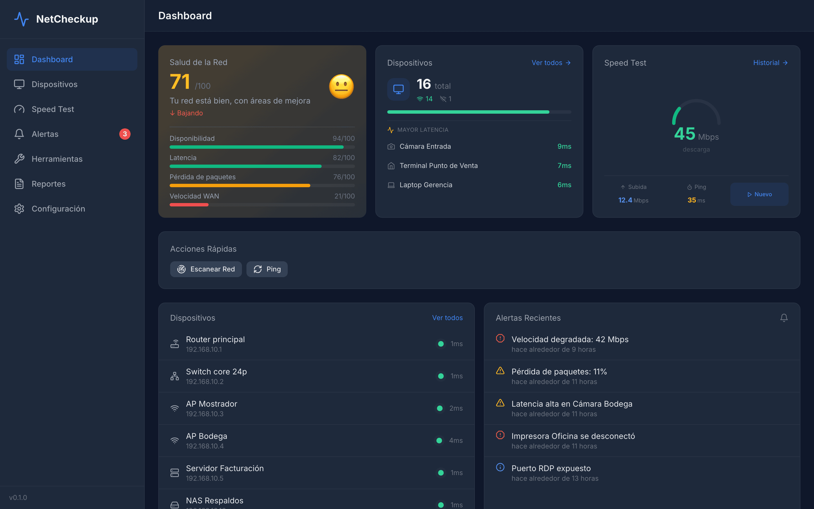
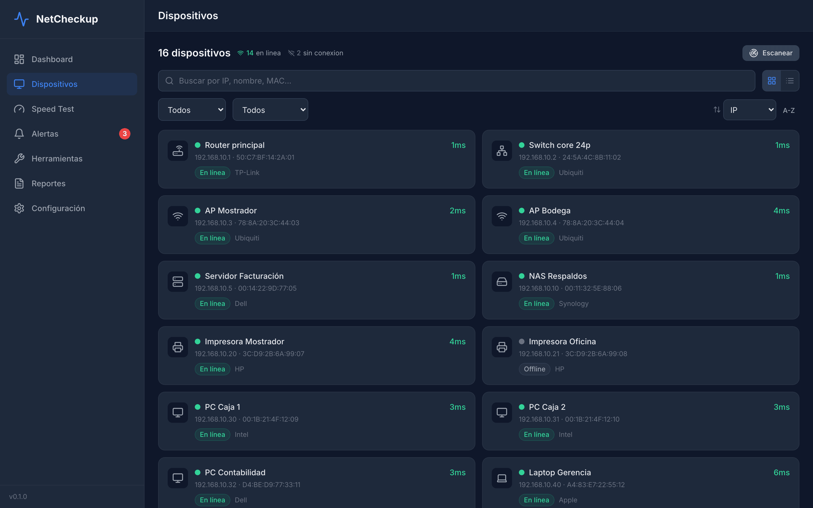
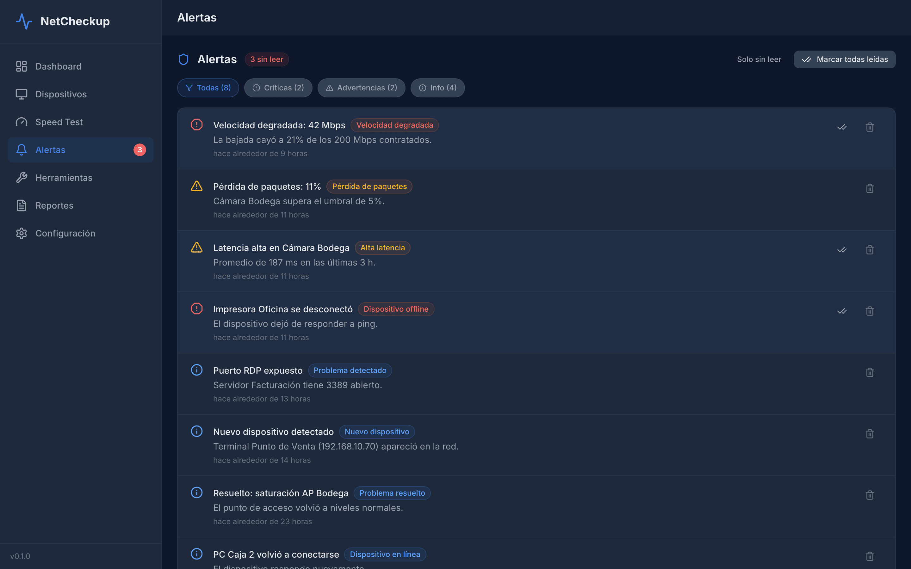
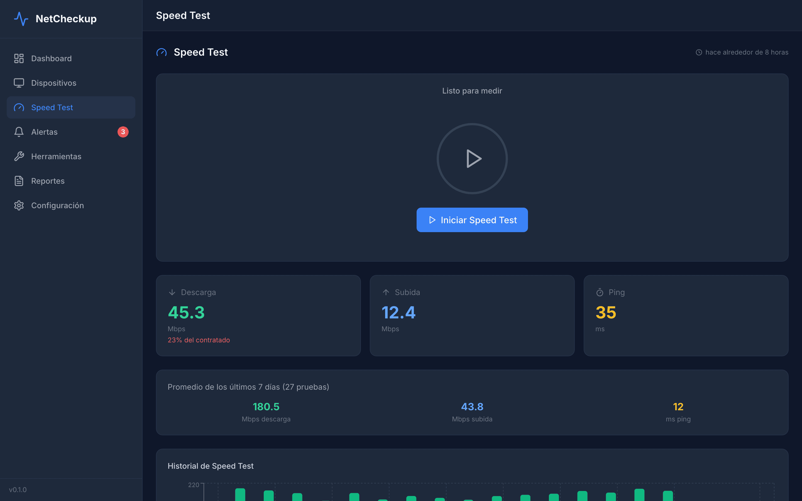
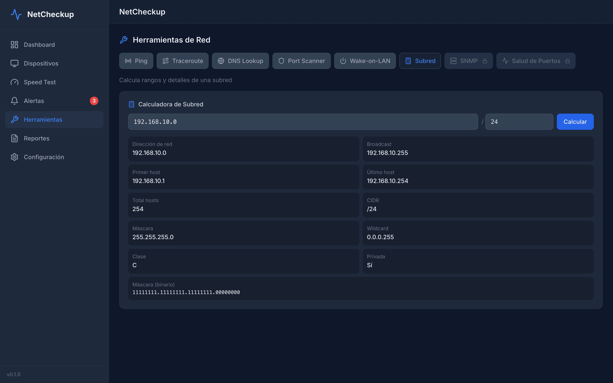

# NetCheckup

**Herramienta de monitoreo y diagnóstico de red para PyMEs.** Descubre los dispositivos
de la red, mide latencia y velocidad, detecta problemas con un motor de reglas y explica
en español cómo resolverlos — sin necesidad de un ingeniero de redes de planta.


## Qué hace

- **Descubrimiento automático** de dispositivos en la subred, con clasificación por tipo
  (router, switch, AP, servidor, impresora, cámara, NAS…) e identificación de fabricante por OUI.
- **Monitoreo continuo** de latencia, jitter y pérdida de paquetes por dispositivo.
- **Speed tests** programados o manuales, contrastados contra la velocidad realmente contratada.
- **Motor de diagnóstico** con 16 reglas (latencia, pérdida, disponibilidad, velocidad, DNS,
  seguridad, infraestructura). Cada problema detectado incluye impacto y recomendación concreta,
  y se resuelve solo cuando deja de detectarse.
- **Health score** de la red con desglose por factores y tendencia histórica.
- **Alertas** in-app, con soporte de Email y Telegram en el backend.
- **Toolkit de red**: Ping, Traceroute, DNS, Port Scanner, Wake-on-LAN, Subnet Calculator y SNMP Query.
- **Diagnóstico de switches por SNMP**: contadores por puerto, top talkers y 6 reglas
  (errores, duplex mismatch, saturación, CRC, discards).
- **Reportes PDF** semanales y mensuales.
- **Network guard**: si el equipo cambia de red, pausa los escaneos para no generar falsos positivos.

## Screenshots

> Las capturas usan **datos de demostración** de una empresa ficticia; no corresponden a
> ninguna red real.

### Dashboard — health score, dispositivos y alertas recientes


### Dispositivos — inventario con estado, latencia y fabricante


### Alertas — clasificadas por severidad, con filtros


### Speed Test — medición contra lo contratado e histórico


### Herramientas — toolkit de diagnóstico


## Stack

| Capa | Tecnología |
|---|---|
| **Agent** (backend) | Node.js 20, TypeScript strict, Express 4, `ws`, node-cron, net-snmp, PDFKit |
| **Dashboard** (frontend) | React 18, Vite, Tailwind CSS, TanStack Query, Recharts, React Router |
| **Base de datos** | SQLite vía `sql.js` (WebAssembly — sin compilación nativa) |
| **Landing** | HTML estático |

## Arquitectura

Monorepo con npm workspaces:

```
packages/
  shared/     → Tipos TypeScript y constantes compartidas
  agent/      → Backend: API REST + WebSocket + scanners + motor de reglas
  dashboard/  → Frontend React (SPA)
  landing/    → Landing page estática
```

El **agent** expone la API en el puerto `7890` y emite eventos por WebSocket (`/ws`) para que
el dashboard se actualice en tiempo real. Las respuestas siguen el formato
`{ success, data, timestamp }`.

El uso de **`sql.js`** en lugar de `better-sqlite3` es deliberado: evita dependencias nativas
con node-gyp, lo que mantiene el empaquetado para Windows y macOS sencillo.

## Requisitos

- **Node.js 20 o superior** (ver `.node-version`)

## Cómo correrlo

```bash
npm install

# 1. Compilar shared PRIMERO — el resto depende de sus tipos
npx tsc -p packages/shared/tsconfig.json

# 2. Compilar el agent
npx tsc -p packages/agent/tsconfig.json
cp packages/agent/src/db/schema.sql packages/agent/dist/db/schema.sql

# 3. Levantar el agent (puerto 7890)
node packages/agent/dist/index.js

# 4. En otra terminal: dashboard en modo dev (puerto 5173, proxy /api → 7890)
cd packages/dashboard && node dev.mjs
```

Abre <http://localhost:5173>.

> **Si el build falla con errores `TS6305`:** el repo incluye archivos `tsconfig.tsbuildinfo`,
> pero `dist/` está en `.gitignore`. En un clon nuevo, TypeScript cree que ya compiló y omite
> el emit. Se soluciona borrando los tsbuildinfo:
> ```bash
> find . -name 'tsconfig.tsbuildinfo' -not -path '*/node_modules/*' -delete
> ```

Si el puerto queda ocupado: `npx --yes kill-port 7890`.

## Configuración

Copia `packages/agent/config.default.yaml` a `config.yaml` en la raíz y ajústalo:
intervalos de escaneo, rango de IP, datos del ISP y velocidad contratada, umbrales de
latencia/pérdida, alertas por email o Telegram, y retención de datos.

## Empaquetado

```bash
npm run dist:win     # Windows
npm run dist:macos   # macOS
npm run dist:all     # ambos
```

## Estado

En desarrollo activo (v0.1.0). Software propietario — todos los derechos reservados.
